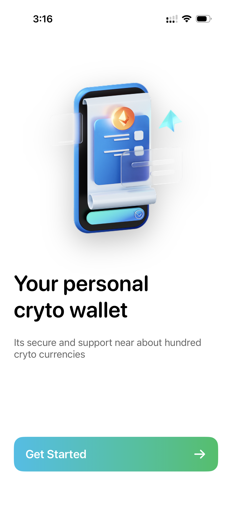
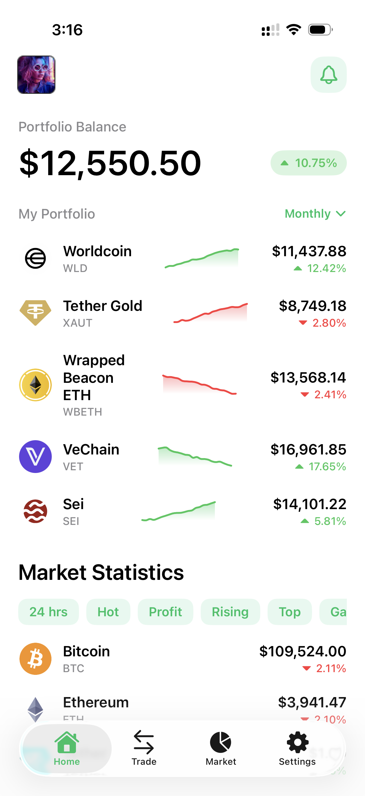
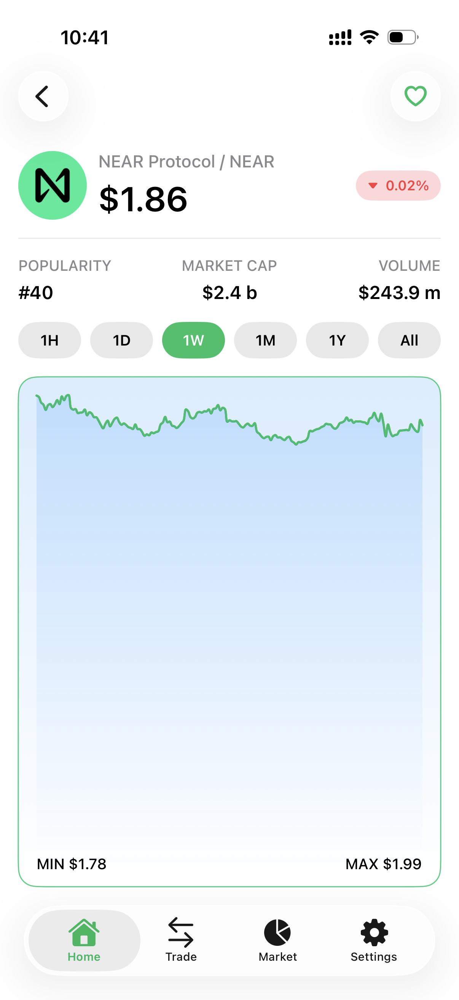
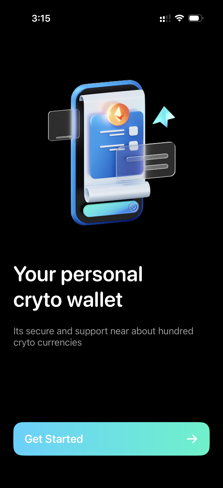
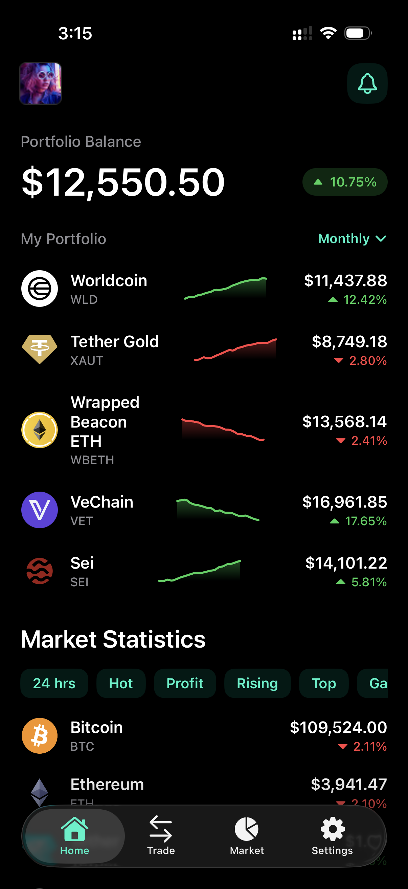
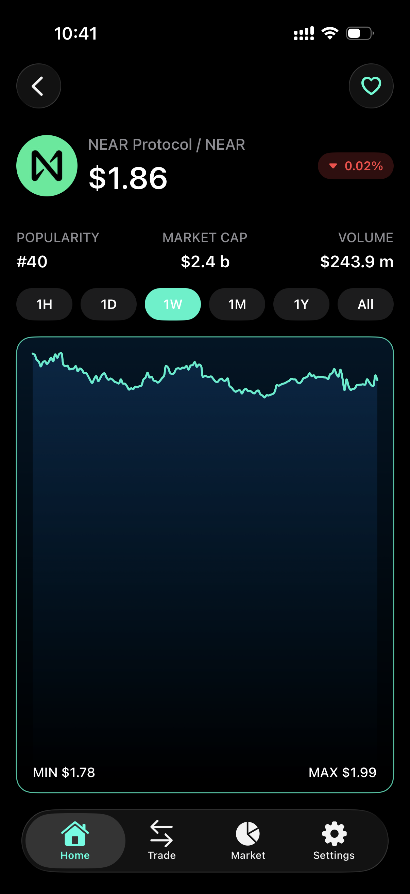

# **myCrypto \- Crypto Price Tracker**

An iOS application for tracking cryptocurrency prices, developed as a coding assignment. This app displays live market data from the CoinGecko API, built with a modern, reactive tech stack. It is also fully compatible with the new iOS 26 Liquid Glass UI.

## **📸 Screenshots**

  
  
  

  
  
  

## **✨ Features**

* **Welcome Screen**: A simple and clean introductory screen to onboard the user.  
* **Crypto List Screen**:  
  * Displays a real-time list of cryptocurrencies with essential data: name, symbol, current price, 24-hour percentage change, market cap, and trading volume.  
  * Shows a mock portfolio balance and performance chart for demonstration.  
  * Implements pull-to-refresh functionality to fetch the latest market data.  
* **Coin Details Screen**:  
  * Provides a detailed view for each cryptocurrency, including market cap, volume, and current price.  
  * Visualizes the coin's performance with a 7-day historical price chart.  
  * Allows users to save their favorite coins to a local watchlist using CoreData.

## **🛠️ Technical Stack & Architecture**

* **UI**: **SwiftUI** for a modern, declarative user interface.  
* **Reactive Programming**: **RxSwift** and **RxCocoa** to handle asynchronous operations, API calls, and UI updates reactively.  
* **Networking**: **Alamofire** for robust and simplified RESTful API communication.  
* **Local Storage**: **CoreData** for persisting the user's favorite coins on the device.  
* **Architecture**: The project follows **Clean Architecture** principles combined with the **MVVM (Model-View-ViewModel)** pattern. This approach ensures a robust separation of concerns, enhances testability, and promotes a highly maintainable and scalable codebase.

## **🔗 API Integration**

The application fetches all cryptocurrency data from the public **CoinGecko API**.

The key endpoints used are:

* GET /api/v3/coins/markets: To fetch the list of cryptocurrencies for the main market screen.  
* GET /api/v3/coins/{id}: To get detailed information for a specific coin.  
* GET /api/v3/coins/{id}/market\_chart: To retrieve historical data for the 7-day price chart.

## **🚀 Getting Started**

Follow these instructions to get the project up and running on your local machine.

### **Prerequisites**

* Xcode 15 or later  
* iOS 17 or later

### **Installation**

1. **Clone the repository:**  
   git clone https://github.com/aungyelin/myCrypto.git
   cd myCrypto

3. Open the project in Xcode:  
   Open the myCrypto.xcodeproj file.
   
4. Build and Run:  
   Select an iOS Simulator or a physical device and press Cmd+R or click the "Run" button in Xcode.
