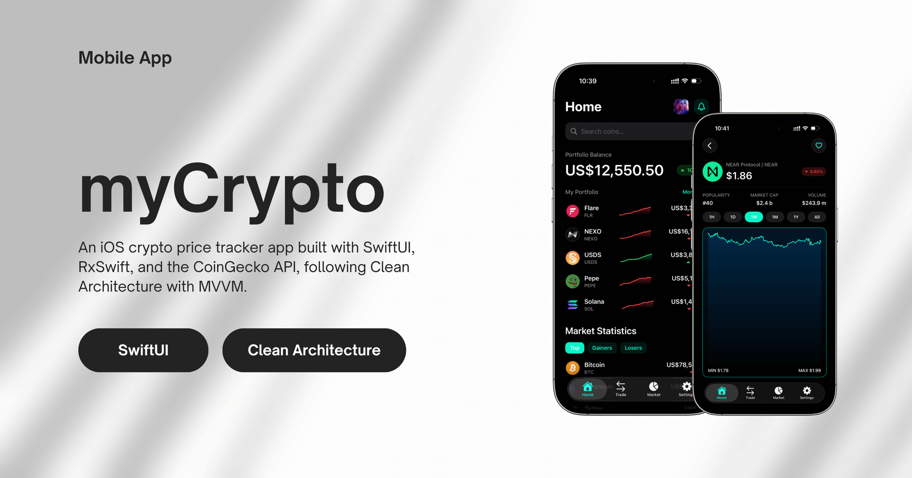
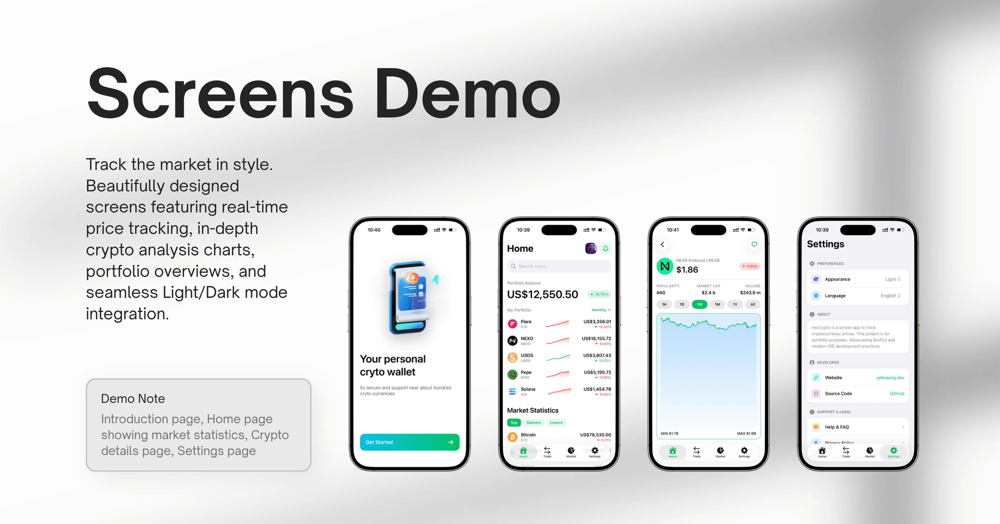

# **myCrypto \- Crypto Price Tracker**

An iOS application for tracking cryptocurrency prices, developed as a coding assignment. This app displays live market data from the CoinGecko API, built with a modern, reactive tech stack. It is also fully compatible with the new iOS 26 Liquid Glass UI.

  
   
   
  

## **✨ Features**

* **Welcome Screen**: A simple and clean introductory screen to onboard the user.  
* **Crypto List Screen**:  
  * Displays a real-time list of cryptocurrencies with essential data: name, symbol, current price, and 24-hour percentage change.
  * **Search & Filter**: Find specific cryptocurrencies instantly by name or symbol.
  * **Sorting**: Quickly sort the market list by Top (Market Cap), Top Gainers, or Top Losers.
  * **Pagination**: Infinite scrolling allows seamless browsing through the entire cryptocurrency market.
  * Shows a mock portfolio balance and performance sparklines for demonstration.  
  * Implements pull-to-refresh functionality to fetch the latest market data.  
* **Coin Details Screen**:  
  * Provides a detailed view for each cryptocurrency, including market cap, volume, and current price.  
  * Visualizes the coin's performance with a 7-day historical price chart.  
  * Allows users to save their favorite coins to a local watchlist using CoreData.
* **Settings & Preferences**:
  * Modern, aesthetic iOS grouped layout.
  * Built-in Appearance toggle (System, Light, Dark).
  * Full localization support with seamless switching between English, 中文 (Chinese), and 日本語 (Japanese).
  * Contains fully routed support screens (Help & FAQ, Privacy Policy, Terms of Service) and a direct repository link.
* **Liquid Glass UI Empty States & Error Handling**: Beautiful, reusable components built for placeholder tabs, and user-friendly network error states featuring one-tap retry functionality.

## **🛠️ Technical Stack & Architecture**

* **UI**: **SwiftUI** for a modern, declarative user interface, optimized with `CachedImage` (`NSCache`) for high-performance scrolling.
* **Networking**: Native **URLSession** and modern **Swift Concurrency (`async/await`)** for robust RESTful API communication without third-party dependencies.
* **Reactive Programming**: **RxSwift** and **RxCocoa** are utilized within the domain and presentation layers to handle reactive data streams and UI bindings.
* **Local Storage**: **CoreData** for persisting the user's favorite coins on the device.
* **State Management**: **@AppStorage (UserDefaults)** for user preferences and **@Published** (`ObservableObject`) for view model state tracking.
* **Navigation**: A custom **Router** pattern using `NavigationStack`, enabling deep decoupled programmatic navigation.
* **Localization**: Modern **String Catalogs** (`.xcstrings`) to efficiently manage multi-language support (English, Chinese, Japanese).
* **Architecture**: The project follows **Clean Architecture** principles combined with the **MVVM (Model-View-ViewModel)** pattern. This approach ensures a robust separation of concerns, enhances testability, and promotes a highly maintainable and scalable codebase.

## **🔗 API Integration**

The application fetches all cryptocurrency data from the public **CoinGecko API**.

The key endpoints used are:

* GET /api/v3/coins/markets: To fetch the list of cryptocurrencies for the main market screen.  
* GET /api/v3/coins/{id}: To get detailed information for a specific coin.  
* GET /api/v3/coins/{id}/market\_chart: To retrieve historical data for the 7-day price chart.

## **🚀 Getting Started**

Follow these instructions to get the project up and running on your local machine.

### **Prerequisites**

* Xcode 15 or later  
* iOS 17 or later

### **Installation**

1. **Clone the repository:**  
   git clone https://github.com/aungyelin/myCrypto.git

3. Open the project in Xcode:  
   Open the myCrypto.xcodeproj file.
   
4. Build and Run:  
   Select an iOS Simulator or a physical device and press Cmd+R or click the "Run" button in Xcode.
